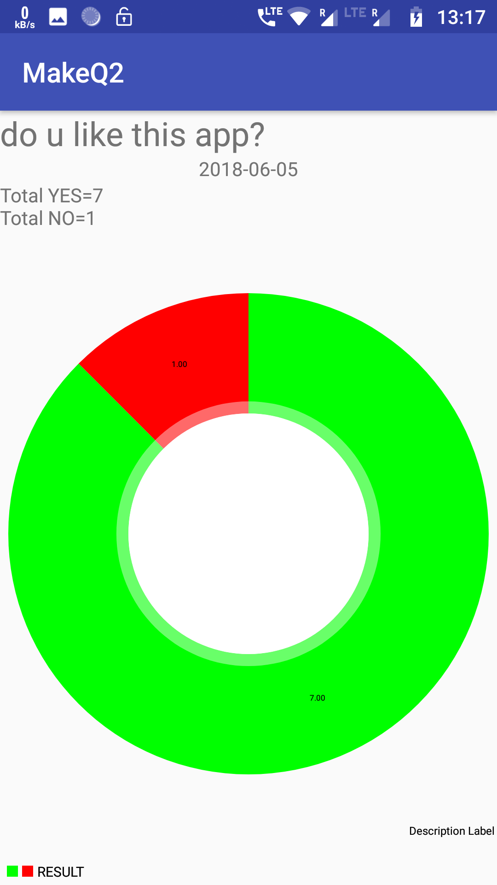

# Admin Application for Voting Application
This is the admin application for voting based application.

# Home

Here admin can add new Questions and see the ananlysis of the previously added questions.

 

# Analysis

Here Admin can see how many users have voted YES or NO for each question and also a pie Chart graph for the same

 

This is maitained throgh an online server with PHP backend and the responses collected from the USER android application

<a href="https://github.com/neel1998/user">Link to user Application</a>
